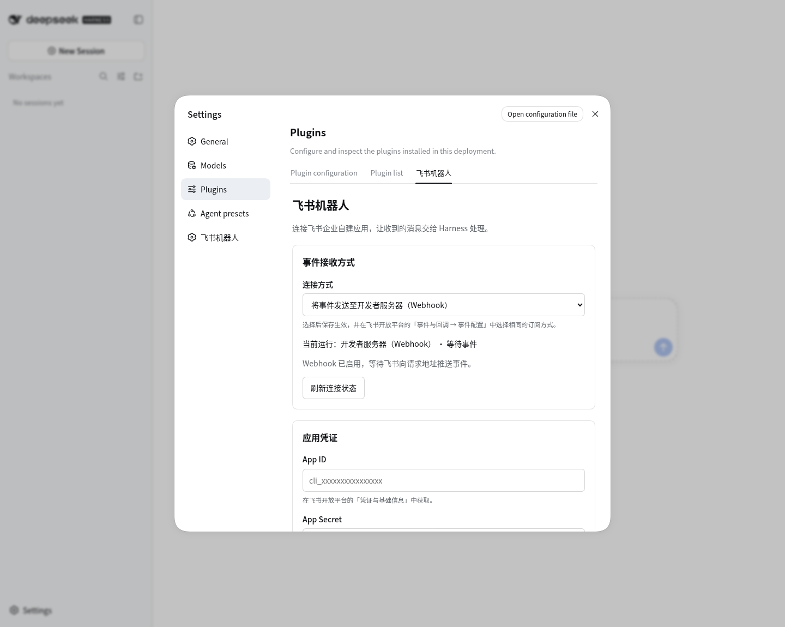

# DeepSeek Harness Feishu Bot

**Start tasks in your local Harness from Feishu and receive text replies to the original message.**

[](https://github.com/icanotcode/dsh-feishu-bot/actions/workflows/test.yml)
[](LICENSE)
[](package.json)

English · [简体中文](README.md)

[Quick start](#quick-start) · [Feishu setup guide (Chinese)](docs/setup.md) · [Troubleshooting (Chinese)](docs/troubleshooting.md) · [Report an issue](https://github.com/icanotcode/dsh-feishu-bot/issues)

## Introduction

`dsh-feishu-bot` connects a Feishu bot to DeepSeek Harness. Enable it in the Harness plugin list, then use its settings page to enter application credentials, choose how to receive events, and set a working directory for tasks.

The plugin supports two connection modes: **developer server (HTTP Webhook)** and **persistent connection (WebSocket)**. Use Webhook if you have a public endpoint or an ngrok tunnel; choose WebSocket if you run Harness locally without a public endpoint. Saving the configuration applies the selected mode.

```text
Feishu text message → Webhook / WebSocket → Harness Agent → Reply to the original Feishu message
```

This is an independently maintained community plugin, unaffiliated with DeepSeek or Feishu. The current version is **0.1.2**. Install it from this repository; it has not been published to npm.

## Settings preview



Actual settings UI captured in an isolated demo environment with no application credentials configured.

## Current capabilities

| Capability | Current behavior |
| --- | --- |
| Native settings entry | Appears in the plugin list; configuration is available on the “飞书机器人” settings page |
| Two event transports | Choose Webhook or WebSocket; saving updates the runtime configuration |
| Text message handling | Receives `im.message.receive_v1` and creates a separate Harness session for each accepted message |
| Automatic replies | Replies to the original message with the Agent's final text; splits long replies into multiple messages |
| Webhook verification | Handles URL verification, Verification Token checks, encrypted payload decryption, and signature verification |
| Connection checks | Tests application credentials, displays WebSocket connection status, and detects local ngrok tunnels |
| Feishu tools | Registers `feishu_*` tools for the Agent; availability depends on application permissions and access to the target resources |

The Feishu tools cover APIs for messages, group chats, contacts, documents, spreadsheets, calendars, tasks, Bitable, and cloud storage. Permission to receive messages does not automatically grant access to these tools. Grant the permissions required by each API you intend to use. See the tool definitions in [lib/index.js](lib/index.js).

### Examples

Send the bot a direct message in Feishu:

> Read the README in the working directory and summarize what this project does.

Or add the bot to a group and @mention it:

> Review the uncommitted changes in the working directory and list any issues that need attention.

A corresponding session appears in Harness, and the plugin sends the final text reply when processing finishes. These are natural-language request examples; the result depends on the model, Agent preset, working directory, and permissions. Each message currently starts a separate session, so include any necessary context in your next message.

## Quick start

### 1. Prepare your environment

- Node.js **22 or later**, npm, and Git.
- A working DeepSeek Harness installation with a model configured and able to answer in the web interface.
- A Feishu enterprise custom app with bot capability enabled, plus its App ID and App Secret.

Compatibility checks currently cover Harness **0.1.5-rc.2** components using the **Web profile**. Other versions and runtime configurations have not been verified.

If Harness is not installed yet, run:

```bash
npm install -g @deepseek-ai/dsh
```

### 2. Install and start

```bash
git clone https://github.com/icanotcode/dsh-feishu-bot.git
cd dsh-feishu-bot
npm ci
npm run install:harness
npm run start:harness
```

Open the local URL printed in the startup log; the default port is `3080`. Search for `feishu` in the plugin list and open **Settings → Plugins → 飞书机器人**. The “飞书机器人” entry in Settings also opens the configuration page.

The installer links this checkout into the Harness `web` profile and adds the required Webhook runtime. It backs up existing configuration before modifying it. **Keep the repository directory after installation.** If another instance already occupies the port, stop that instance in its original terminal first; the startup script does not stop services automatically. If you customize `DSH_HOME`, use the same value for installation and startup.

### 3. Choose a connection mode

Enter your App ID, App Secret, the absolute path to an existing working directory, and an Agent preset. Then choose how to receive events:

| Item | Developer server (Webhook) | Persistent connection (WebSocket) |
| --- | --- | --- |
| Connection direction | Feishu pushes events to a public HTTPS endpoint | Your machine initiates a connection to Feishu |
| Public URL / ngrok | Requires a reachable HTTPS endpoint; ngrok is one option | Not required |
| Application credentials | App ID and App Secret | App ID and App Secret |
| Callback verification | Verification Token; Encrypt Key is also needed when encryption is enabled | Token / Encrypt Key not required |
| Feishu console subscription method | Send events to a developer server | Receive events through a persistent connection |
| Selection | Default mode | Select in the settings page and save |

Both modes require subscribing to **Receive message (`im.message.receive_v1`)**, granting permission to receive and reply to messages, and completing Feishu's app version publishing/activation process.

- **Webhook:** enter `https://your-domain.example` in the plugin's “公网服务地址” field. Save the verification credentials first, then enter the full URL `https://your-domain.example/webhook/feishu` in the Feishu console.
- **WebSocket:** save the application credentials and connection mode. Wait for the plugin to show that it is connected, then select persistent connection in the Feishu console and configure the event subscription.

See the **[Feishu setup guide (Chinese)](docs/setup.md)** for field descriptions, permissions, ngrok commands, and the configuration sequence.

### 4. Verify your first reply

Send the bot a simple text message in a Feishu direct chat. Confirm that a session appears in Harness and that a final reply arrives in Feishu. For a group chat test, add the bot to the group and @mention it.

A successful credential test confirms application authentication. Saving the request URL successfully confirms URL verification. A connected WebSocket confirms that a connection has been established. Only an actual bot reply verifies the complete flow.

## Defaults and data storage

| Setting | Default behavior |
| --- | --- |
| Connection mode | `webhook` |
| Callback path | `/webhook/feishu` |
| Agent preset | `standard`; it must already be installed in Harness |
| Permission preset | `workspace-write`; you can select other presets, such as read-only, in the settings page |
| Working directory | The source installer initializes this to the checkout's parent directory; change it to your project directory before first use |
| Model | Uses the default Harness model configuration unless specified separately |
| Non-secret configuration | Stored in `feishu-bot.json` under `DSH_HOME`; the default `DSH_HOME` is `~/.dsh` |
| Secrets | Saved by the Harness credentials service; blank settings fields preserve existing values. Values supplied through environment variables must be changed in the startup environment |

The bot executes requests using the selected working directory and permissions. The plugin currently has no separate user or group allowlist. Set an appropriate app availability scope in Feishu and choose a permission preset suitable for your tasks.

## Support boundaries and verification status

The chat entry point currently supports text messages and final text replies. It does not yet support image/file input, streaming output, conversation continuity across messages, or plugin slash commands. Message deduplication and reply associations are held in process memory; restarting does not restore undelivered replies.

Apart from `im.message.receive_v1`, the plugin does not handle bot join/leave events, message read/recall events, reactions, cloud document comments, or meeting/notes/minutes events. **`card.action.trigger` card button callbacks** and scheduled task execution are also not implemented. There is no need to subscribe to these extra events for this plugin.

Unit tests and local browser checks are in place. **End-to-end acceptance testing with real Feishu messages has not yet been completed.** You are welcome to try the setup guide and report your environment, reproduction steps, and sanitized logs.

## Frequently asked questions

- **Saving the request URL reports a 3-second timeout:** check the forwarded port, full callback path, proxy login interception, and Encrypt Key configuration first.
- **Why does the URL need `/webhook/feishu`?** The domain routes the request to the server; the path routes it to the Feishu receiver. The root path serves the Harness page by default.
- **The plugin says connected, but no reply arrives:** check event subscriptions, app publishing, message permissions, and execution results in the Harness session.

See the **[troubleshooting guide (Chinese)](docs/troubleshooting.md)** for detailed steps and HTTP status codes.

## Updating and contributing

Update from the repository directory, then restart the Harness instance that uses this plugin:

```bash
git pull --ff-only
npm ci
npm run install:harness
```

Run `npm test` for local verification. Read the [contribution guide (Chinese)](CONTRIBUTING.md) before reporting a problem or proposing an improvement. A [community introduction draft (Chinese)](docs/community-introduction.md) is available if you want to share the plugin.

## License and reference

The code is licensed under [MIT](LICENSE). Third-party dependencies retain their respective licenses.

The documentation structure takes inspiration from the bilingual entry points and separate setup guides in [xmanrui/dsh-im](https://github.com/xmanrui/dsh-im). The capabilities listed here describe this repository's implementation.
