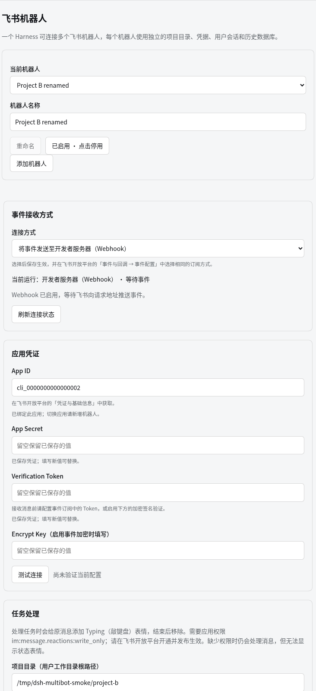
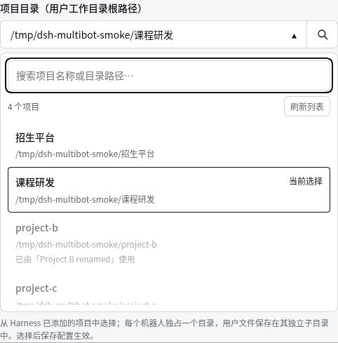

# DeepSeek Harness Feishu Bot

**Start tasks in your local Harness from Feishu and receive replies and files on the original message.**

[](https://github.com/icanotcode/dsh-feishu-bot/actions/workflows/test.yml)
[](LICENSE)
[](package.json)

English · [简体中文](README.md)

[Quick start](#quick-start) · [Feishu setup guide (Chinese)](docs/setup.md) · [Troubleshooting (Chinese)](docs/troubleshooting.md) · [Report an issue](https://github.com/icanotcode/dsh-feishu-bot/issues)

## Introduction

`dsh-feishu-bot` connects multiple Feishu bots to one DeepSeek Harness server, with a separate project for each bot. Expand its card in the Harness Plugin list to select or add a bot, configure its application credentials and event transport, and choose its project directory.

The plugin supports two connection modes: **developer server (HTTP Webhook)** and **persistent connection (WebSocket)**. Use Webhook if you have a public endpoint, ngrok, or Cloudflare Tunnel; choose WebSocket if you run Harness locally without a public endpoint. Saving the configuration applies the selected mode.

```text
Feishu text / rich text / attachments → Webhook / WebSocket → Harness Agent → Replies and files
```

This is an independently maintained community plugin, unaffiliated with DeepSeek or Feishu. The current version is **0.2.0**. Install it from this repository; it has not been published to npm.

## Settings preview



Current multi-bot settings captured in an isolated test instance, showing selection, creation, enable/disable controls, and a separate project directory. The App ID and path are test data; passwords remain blank. The settings dialog was enlarged for the screenshot to show the upper form together.

## Current capabilities

| Capability | Current behavior |
| --- | --- |
| Multiple bots and projects | One Harness serves multiple Feishu applications with separate credentials, name profiles, sessions, history databases, and attachments |
| Plugin list entry | Expand the `feishu-bot` card in Plugin list to configure the plugin directly |
| Two event transports | Choose Webhook or WebSocket; saving updates the runtime configuration |
| Messages and attachments | Receives text, rich text (`post`), images, files, video, and audio through `im.message.receive_v1`; reuses the current session for the same tenant, user, and chat |
| File replies and image reading | Sends files or media from the user workspace to the current message; models declaring image input can inspect older images |
| Personal email sending | Bind your own Feishu mailbox, SMTP authorization code, and fixed recipient in a direct chat; send text and personal-workspace attachments on explicit request; no inbox access |
| Working indicator | Adds a `Typing` reaction to the original message when processing starts and attempts to remove it when processing ends; reaction failures do not block the task or reply |
| Automatic replies | Replies to the original message with the Agent's final text; splits long replies into multiple messages |
| Webhook verification | Handles URL verification, Verification Token checks, encrypted payload decryption, and signature verification |
| Public endpoints | Webhook supports ngrok, Cloudflare Tunnel, or a custom HTTPS address; ngrok / Cloudflare can be launched and supervised from the panel |
| Connection checks | Tests application credentials, displays WebSocket connection status, and detects local ngrok tunnels |
| User access | Feishu app availability controls access; each user must provide and confirm a name before tasks, with no prefilled `open_id` or name list |
| User isolation | Separate user workspaces and SQLite databases, with separate context per chat; identical names do not merge data |
| Session controls | At most one current visible Harness session per user within each bot, named after their confirmed name; `/new`, `/whoami`, `/help`, `/status` |
| History | Timestamped records; Agent tools can search, read, add notes, update, and soft-delete records belonging to the current user and chat |
| Daily reset | Archives the old session at 04:00 Asia/Macau by default; the next message starts fresh context, after running work finishes; history and files remain |

**Remote Feishu sessions only receive restricted workspace-file, personal-history, current-message attachment, and personal-mail tools.** Arbitrary shell execution, general MCP tools, and Feishu APIs that could access other users’ data are not exposed. Workspace-write only applies to the user’s own directory; read-only forbids workspace file changes. New users inherit their bot’s permission preset. Existing per-user permission overrides from older configurations are retained. The local Harness administrator retains control of the host and stored data.

### Examples

Complete name confirmation first, then send the bot a direct message in Feishu:

> Read the README in the working directory and summarize what this project does.

Or add the bot to a group and @mention it:

> Update the proposal in my working directory using the requirements we discussed earlier.

A corresponding session appears in Harness, and the plugin sends the final text reply when processing finishes. These are natural-language request examples; the result depends on the model, Agent preset, working directory, and permissions. Follow-up messages in the same chat reuse context. `/new`, or switching to another direct or group chat, archives the previous session before starting fresh context. Each user has at most one current visible session within each bot; running work finishes before the switch rather than being cancelled.

### Files, images, video, and audio

After confirming your name, send files, images, video, audio, or Feishu rich-text (`post`) messages containing images. Resources are saved under `incoming/...` in your own workspace. History records retain the original filename, receipt time, and relative path so you can search by name or date later. `/new` and daily context resets do not delete these files. Before name confirmation, the plugin only asks for your name and does not download attachments; resend them after confirming.

| Operation | Plugin limit |
| --- | --- |
| Incoming resources | Up to 10 resources and 100 MiB total per message |
| Outgoing images | Up to 10 MiB each |
| Outgoing files, video, and audio | Up to 30 MiB each |
| Video messages | MP4 only; send other formats as ordinary files |
| Audio messages | OPUS only; send other formats as ordinary files |

For example, ask the Agent to turn a CSV into a Markdown table and send it back. With `workspace-write` permission, the restricted `workspace_write` tool can create TXT, Markdown, or CSV files, then `feishu_send_file` uploads the result and replies to the current Feishu message. A path printed in a text reply does not send a file.

The sending tool takes `feishu_send_file(path, kind, coverPath?, duration?)`: `path` is relative to the current user's workspace; `kind` is `file` (default), `image`, `video`, or `audio`; `coverPath` is a workspace-relative video cover image; `duration` is in milliseconds. There is no recipient argument. Sending is only available while processing the currently claimed Feishu message, not from an idle Harness session or to an arbitrary recipient.

Image understanding uses the model already configured in Harness, and only when that model explicitly declares image input. `feishu_read_image` can inspect older images in the user's workspace. Text-only models can save, find, and send image files but cannot view them. Media transfer does not add automatic video analysis, transcription, OCR, conversion, general PDF/Office parsing, or arbitrary shell access. This is a plugin update: no Harness core modification, extra model, or additional settings navigation is required.

Enable the corresponding API permissions and publish the app as described in the [attachment permissions guide (Chinese)](docs/setup.md#附件权限).

### Send through your personal Feishu mailbox

Complete name confirmation first. Ordinary conversation does not require an email binding. Your first request to send email, or `/mail` in a direct chat with the bot, starts setup: provide **your own Feishu mailbox → SMTP authorization code → recipient address**. Submit the code as `/mail code YOUR_CODE` when prompted. Plain text sent while waiting for the code is also intercepted before reaching the Agent. Authentication checks SMTP login only; it does not send a test email.

Once ready, explicitly ask the Agent again to email a summary or a file. Requests made before setup are not automatically replayed. The sender and recipient come from your binding; the Agent cannot supply another account or recipient. Use `/mail status` to check the binding, `/mail to ADDRESS` to change the recipient, `/mail reset` to delete your binding, or `/mail cancel` to cancel unfinished setup while retaining an already-ready binding. Bindings are isolated by bot, tenant, and stable user ID, independently of display names.

The plugin reads `skills/feishu-assistant/SKILL.md` and adds its instructions to each Feishu message entering the Agent; no separate Skill installation is required. This thin Skill supplies conversation and mail-tool guidance; the plugin's entry state machine handles name confirmation, email setup, and authorization-code protection. Codes are stored in Harness credentials and redacted before Webhook delivery, history, or model input. **The plugin does not remove the original messages retained by Feishu itself.**

Sending uses the fixed `smtp.feishu.cn:465` endpoint with mandatory TLS, as described in [Feishu's third-party client guide](https://www.feishu.cn/hc/zh-CN/articles/902478147400). IMAP/inbox access is not implemented. Mail tools require a name-confirmed user with an active direct-chat task. `feishu_send_email` accepts a subject, text, and up to 10 paths within that user's directory; the estimated MIME message limit is 10 MiB and the text limit is 1 MiB. SQLite-backed deduplication protects repeated sends with the same message and content. **SMTP acceptance is not proof of delivery**; uncertain failures are not automatically retried. Real external-email delivery has not yet received end-to-end acceptance testing. See the [setup guide (Chinese)](docs/setup.md#个人邮箱发信) for the commands and details.

## Quick start

### 1. Prepare your environment

- Node.js **22.13 or later**, npm, and Git. History storage uses built-in `node:sqlite`.
- A working DeepSeek Harness installation with a model configured and able to answer in the web interface.
- A Feishu enterprise custom app with bot capability enabled, plus its App ID and App Secret.

Compatibility checks currently cover Harness **0.1.5-rc.2** components using the **Web profile**. Other versions and runtime configurations have not been verified.

The plugin targets Linux, Windows, and macOS using the same Node.js installation commands. Webhook mode requires the appropriate ngrok or cloudflared binary for your OS; WebSocket mode needs no tunnel. Local checks were performed on Linux; a three-OS CI configuration does not imply live Feishu messaging has been verified on all three systems. On Windows, use PowerShell and a local Windows workspace path instead of copying Bash aliases.

The settings page reads the actual Harness listening port and generates tunnel commands from it. To change that port, stop the existing Harness process and restart with `npm run start:harness -- --port 4321`, then point the tunnel at the same port. Saving plugin settings does not change the shared Harness listener.

If Harness is not installed yet, run:

```bash
npm install -g @deepseek-ai/dsh
```

### 2. Install and start

```bash
git clone https://github.com/icanotcode/dsh-feishu-bot.git
cd dsh-feishu-bot
npm ci
npm run install:harness
npm run start:harness
```

Open the local URL printed in the startup log; the default port is `3080`. Open **Settings → Plugins → Plugin list**, search for `feishu`, and expand the `feishu-bot` card under **Global plugins** to configure it directly. This is the only entry; the plugin no longer adds a separate Feishu tab or sidebar item.

The installer links this checkout into the Harness `web` profile and adds the required Webhook runtime. It backs up existing configuration before modifying it. **Keep the repository directory after installation.** If another instance already occupies the port, stop that instance in its original terminal first; the startup script does not stop services automatically. If you customize `DSH_HOME`, use the same value for installation and startup.

### 3. Choose a connection mode

Enter your App ID, App Secret, and Agent preset. In **任务处理**, click **搜索项目**, search by project name or path, and select a project directory. The list contains projects added to Harness and directories already bound to bots; it does not scan the disk. Users remain restricted to their own directories under the selected project’s `.feishu-users/`, without access to existing project files. Then choose how to receive events:

| Item | Developer server (Webhook) | Persistent connection (WebSocket) |
| --- | --- | --- |
| Connection direction | Feishu pushes events to a public HTTPS endpoint | Your machine initiates a connection to Feishu |
| Public URL / tunnel | Requires a reachable HTTPS endpoint via ngrok, Cloudflare Tunnel, or a custom address | No tunnel required |
| Application credentials | App ID and App Secret | App ID and App Secret |
| Callback verification | Verification Token; Encrypt Key is also needed when encryption is enabled | Token / Encrypt Key not required |
| Feishu console subscription method | Send events to a developer server | Receive events through a persistent connection |
| Selection | Default mode | Select in the settings page and save |

Both modes require subscribing to **Receive message (`im.message.receive_v1`)**, granting permission to receive and reply to messages, and completing Feishu's app version publishing/activation process.

- **Webhook:** enter `https://your-domain.example` in the plugin's “公网服务地址” field. Save the verification credentials first, then enter the full URL `https://your-domain.example/webhook/feishu` in the Feishu console.
- **WebSocket:** save the application credentials and connection mode. Wait for the plugin to show that it is connected, then select persistent connection in the Feishu console and configure the event subscription.

To start a Cloudflare Quick Tunnel in another terminal, install `cloudflared` first, then run:

```bash
npm run start:cloudflare -- --port 3080
```

Select **Cloudflare Tunnel** in the plugin, copy the generated `https://…trycloudflare.com` root URL from the log into “公网服务地址”, and save. The default bot uses `/webhook/feishu`; for added bots, copy the full callback URL generated in their own panel. Quick Tunnel URLs change between runs; use a named tunnel for a stable setup. The plugin panel can also launch and supervise the tunnel. Saving an address alone does not verify public reachability.

See the **[Feishu setup guide (Chinese)](docs/setup.md)** for field descriptions, permissions, commands for both tunnel providers, and the configuration sequence.

### Connect multiple bots to one server

Use **当前机器人** at the top of the plugin card to select an application. Choose **添加机器人**, enter a display name and select a project directory using **搜索项目**, then save that bot's App ID, App Secret, and event transport. Each bot must use a different Feishu App ID and a distinct project directory. Webhook and WebSocket bots can run together.

The project picker works the same way in **任务处理** and **添加机器人**: click the directory field to open the project list. Only the separate search icon reveals the search box; typing a project name or path filters the same list immediately. Select a result, then save the configuration or create the bot. It lists Harness’s registered projects and directories already bound to bots, without scanning the disk. Directories assigned to another bot or unavailable on disk cannot be selected. If a project is missing, add it in Harness first, then refresh the list. Selecting a project does not grant access to all of its files: each remote user remains restricted to their own `.feishu-users/<identity-hash>/` directory.



Once an App ID is bound, it cannot be replaced. Add a new bot for another Feishu application so each application retains its own history. You can update the same application’s App Secret and other credentials after any running task finishes.

**重命名** changes only the display name. **停用** preserves configuration and stored data while preventing new messages and tasks; disabling a busy bot is rejected until its task finishes. Switching away from unsaved configuration requires confirmation. Credentials are never copied into another bot's form.

ngrok / Cloudflare is one shared server tunnel, managed under **默认机器人（共享隧道设置）**. These controls remain available when the default bot uses WebSocket but another enabled bot requires Webhook. Each bot has a separate callback path: the default retains `/webhook/feishu`, while added bots receive unique subpaths. Copy the selected bot's full callback URL into the matching Feishu application. If the public base URL changes, update every Webhook application's callback.

If an existing ingress policy only allows the default callback, also allow POST requests to each added bot's callback path. Keep the management UI protected; the plugin does not rewrite your ingress policy.

Existing credentials, workspaces, sessions, and history remain attached to the default bot on upgrade. Added bots do not inherit application secrets or user profiles. The same person confirms their name independently for each bot and uses separate project data. The one-current-session rule applies to each user within each bot.

### Start and supervise tunnels

Select the default bot to manage the shared tunnel. Install the native ngrok or cloudflared binary for Linux, Windows or macOS, then use PATH or set an absolute executable path in the plugin. Save the provider settings and click **启动当前端口的隧道**. The actual Harness port is used; no Bash alias is involved.

The **隧道守护** switch takes effect after saving. It starts a missing tunnel and retries unexpected exits with backoff capped at 60 seconds. Turning it off disables retries without stopping a running child. **停止托管隧道** stops only the plugin-owned child and pauses supervision until manual start or an off/save/on/save cycle. This supervisor runs inside Harness, not as an OS service; shutdown cleans up its own child processes.

ngrok supports an explicit Traffic Policy path or auto-detects `~/.config/ngrok/policy.yaml` without editing it. Matching external ngrok tunnels are detected and never terminated by the plugin. Cloudflare supports Quick Tunnels and existing **locally managed named tunnels** with a local YAML file, credentials and DNS already configured. A private temporary copy updates the matching hostname's local service to the current Harness port; the original file is preserved. Dashboard token-only remotely managed tunnels are not supported by this launcher.

Quick Tunnel addresses may change after restart: update the Feishu callback URL when that happens. A running process or registered tunnel does not prove Feishu callback delivery. See the setup guide for field descriptions and troubleshooting.

### 4. Verify your first reply

Set the app availability scope in Feishu. The plugin no longer requires a local list of user IDs and names. When prompted for your name, reply `Alex`, `我叫Alex`, or `/name Alex`; check the repeated name, then reply **`确认`** to confirm.

**Before confirmation, the plugin only handles name confirmation and does not answer other questions or execute tasks.** `/new`, `/status`, `/whoami`, and `/help` cannot bypass this step. Resend your task after confirming: earlier requests are not executed automatically. The confirmed name survives restarts, `/new`, and daily resets. Users with a name in the old configuration must also personally confirm once.

After confirming your name, send a simple message, verify the named Harness session and final Feishu reply, and send a follow-up to check continuity. Use `/new` to test switching sessions. For group chats, add the bot and @mention it.

A successful credential test confirms application authentication. Saving the request URL successfully confirms URL verification. A connected WebSocket confirms that a connection has been established. Only an actual bot reply verifies the complete flow.

## Defaults and data storage

| Setting | Default behavior |
| --- | --- |
| Connection mode | `webhook` |
| Public endpoint provider | `ngrok`; Webhook settings also offer Cloudflare Tunnel and a custom public URL |
| Callback path | The default bot retains `/webhook/feishu`; added bots receive unique subpaths |
| Agent preset | `standard`; it must already be installed in Harness |
| Permission preset | `workspace-write`; `read-only` is the only alternative, and full-access presets are rejected |
| Project directory | Select from the searchable Harness project dropdown; each user only accesses their own subdirectory under `.feishu-users/` |
| User access | Controlled through Feishu app availability; provide a name and reply `确认` before starting tasks |
| Daily context reset | `04:00` in `Asia/Macau`; archives the old session after running work finishes, retaining SQLite history and archived Harness logs |
| Model | Uses the default Harness model configuration unless specified separately |
| Non-secret configuration | The default retains `feishu-bot.json`; added bots use separate configuration files and a bot catalog under `DSH_HOME` (default `~/.dsh`) |
| Secrets | Saved by the Harness credentials service; blank settings fields preserve existing values. Values supplied through environment variables must be changed in the startup environment |

Deleting a Feishu workspace in the Harness UI only removes its registration. The next ordinary message recreates that registration and reconnects the existing session, preserving context. Deleting the actual working directory is different: the plugin can recreate an empty directory but cannot recover deleted working files; its separately stored history database is unaffected by removing only that directory.

Archiving the active Feishu session in Harness causes the next ordinary Feishu message to start a new, visible session. Existing work finishes first. The old session stays archived and its history remains searchable; its model context is not copied into the new session. `/status` reports an archived current session.

Databases are separated by stable bot source, tenant, and user identity. Names are stored in user profiles and used for session titles, not as database or workspace paths. Two users with the same name still have separate data. Switching between a user’s direct and group chats archives the previous active context before creating a new one. History tools remain restricted to records for the current user and chat, with timestamps stored in local SQLite databases.

`/new` and daily resets archive the old entry from the current Harness session list while retaining SQLite history, archived Harness logs, and working files. A new session is created on the next message. On restart, the plugin also archives leftover entries for already-closed sessions. Legacy databases missing identity metadata are updated on the first verified Feishu message; subsequent daily resets run even when no new messages arrive.

Ask the Agent to find an older discussion, add a project note, or correct a record. Updating or soft-deleting history does not rewrite original Harness logs, Feishu messages, or already-loaded model context. Send `/new` to refresh context afterward. History CRUD is not a full data-erasure mechanism.

## Support boundaries and verification status

The chat entry point supports text, rich text, and image/file/video/audio input, final text replies, and file replies to the current message. Streaming output is not supported. History is persisted, but it is not a reliable delivery queue; restarting during a task does not guarantee recovery of undelivered replies.

Apart from `im.message.receive_v1`, the plugin does not handle bot join/leave events, message read/recall events, user reaction events, cloud document comments, or meeting/notes/minutes events. **`card.action.trigger` card button callbacks** and general scheduled task execution are also not implemented. Daily context reset is not an arbitrary cron scheduler. There is no need to subscribe to these extra events for this plugin. Adding/removing the `Typing` indicator does not require a reaction event subscription; it requires `im:message.reactions:write_only`. Publish/activate the updated app permissions in Feishu before testing. See the setup guide.

Automated tests and local checks are in place. **The 0.2.0 multi-user flow with real Feishu messages and complete cross-platform operation still require acceptance testing.** You are welcome to try the setup guide and report your environment, reproduction steps, and sanitized logs.

## Frequently asked questions

- **Saving the request URL reports a 3-second timeout:** check the forwarded port, full callback path, proxy login interception, and Encrypt Key configuration first.
- **Why does the URL need `/webhook/feishu`?** The domain routes the request to the server; the path routes it to the Feishu receiver. The root path serves the Harness page by default.
- **The plugin says connected, but no reply arrives:** check event subscriptions, app publishing, message permissions, and execution results in the Harness session.

See the **[troubleshooting guide (Chinese)](docs/troubleshooting.md)** for detailed steps and HTTP status codes.

## Updating and contributing

**Upgrading to the current version:** review the app availability scope in Feishu. The local user allowlist no longer controls admission; existing per-user permission overrides are retained. Every user must personally provide and confirm a name once after upgrading; names in the old configuration do not complete this step. Replace legacy full-access permissions with read-only or workspace-write. Remote sessions no longer expose general shell, MCP, or cross-user Feishu tools. Old per-message sessions are not automatically merged or imported into the new history databases.

Update from the repository directory, then restart the Harness instance that uses this plugin:

```bash
git pull --ff-only
npm ci
npm run install:harness
```

See the [changelog (Chinese)](CHANGELOG.md) for release changes. Run `npm test` for local verification. Read the [contribution guide (Chinese)](CONTRIBUTING.md) before reporting a problem or proposing an improvement. A [community introduction draft (Chinese)](docs/community-introduction.md) is available if you want to share the plugin.

## License and reference

The code is licensed under [MIT](LICENSE). Third-party dependencies retain their respective licenses.

The documentation structure takes inspiration from the bilingual entry points and separate setup guides in [xmanrui/dsh-im](https://github.com/xmanrui/dsh-im). The capabilities listed here describe this repository's implementation.
