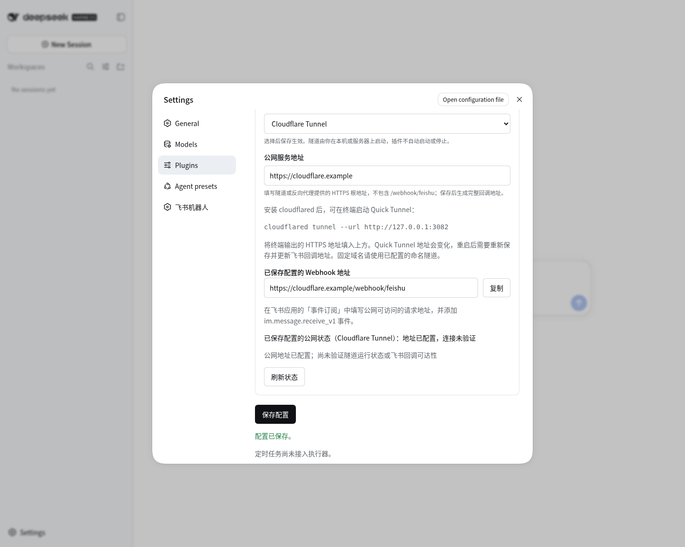

# DeepSeek Harness 飞书机器人

**从飞书向本机 Harness 发起任务，在原消息下接收答复与文件。**

[](https://github.com/icanotcode/dsh-feishu-bot/actions/workflows/test.yml)
[](LICENSE)
[](package.json)

简体中文 · [English](README.en.md)

[快速开始](#快速开始) · [飞书接入指南](docs/setup.md) · [常见问题](docs/troubleshooting.md) · [反馈问题](https://github.com/icanotcode/dsh-feishu-bot/issues)

## 简介

`dsh-feishu-bot` 是 DeepSeek Harness 的飞书机器人插件。在 Harness 的 Plugin list 中展开插件卡片，即可填写应用凭据、选择事件接收方式和任务工作目录。

插件提供 **开发者服务器（HTTP Webhook）** 和 **长连接（WebSocket）** 两种接入方式：已有公网地址、ngrok 或 Cloudflare Tunnel 的用户可以使用 Webhook；只在本机运行、没有公网入口的用户可以选择长连接。保存配置后切换生效。

```text
飞书文本 / 图文 / 附件 → Webhook / 长连接 → Harness Agent → 回复原消息与文件
```

这是独立维护的社区插件，与 DeepSeek、飞书无隶属关系。当前版本为 **0.2.0**，通过本仓库源码安装；尚未发布到 npm。

## 设置界面



实际设置界面，拍摄于独立演示环境，未填写应用凭据。截图展示旧版 0.1.3 的 Cloudflare 接入配置；当前入口已移至 Plugin list 卡片内，截图也未包含当前的姓名确认流程与上下文切换设置；示例域名不代表公网连通。

## 当前能力

| 能力 | 当前行为 |
| --- | --- |
| 插件列表入口 | 在 Plugin list 中展开 `feishu-bot` 卡片，直接管理配置 |
| 两种接收方式 | Webhook 与长连接二选一，保存后更新运行状态 |
| 消息与附件 | 接收 `im.message.receive_v1` 的文本、图文（`post`）、图片、文件、视频和音频；同一租户、用户和聊天复用当前 Harness 会话 |
| 文件发送与看图 | 向当前消息回复个人目录中的文件或媒体；明确支持图片的模型可读取历史图片 |
| 工作状态 | 开始处理时在原消息添加敲键盘表情回应（`Typing`），结束时尝试清除；状态更新失败不阻断任务或答复 |
| 自动答复 | Agent 完成后向原消息回复最终文本，较长回复分段发送 |
| Webhook 验证 | 处理地址验证、Verification Token、加密请求解密和签名校验 |
| 公网接入 | Webhook 可选 ngrok、Cloudflare Tunnel 或自定义 HTTPS 地址；ngrok / Cloudflare 可在面板启动并守护 |
| 连接检查 | 测试应用凭据、显示长连接状态、检测本机 ngrok 隧道 |
| 用户接入 | 飞书后台控制应用可用范围；首次对话必须提供并确认姓名，无需预填 `open_id` 或用户名 |
| 用户隔离 | 每用户独立工作目录及 SQLite 数据库，不同聊天上下文分开；重名不会合并数据 |
| 会话管理 | 每位用户同一时间最多一个当前可见的 Harness 会话，以确认的姓名命名；支持 `/new`、`/whoami`、`/help`、`/status` |
| 历史记录 | 保存消息时间戳，Agent 可查询、读取、创建笔记、修改及软删除当前用户在当前聊天的记录 |
| 每日切换 | 默认 Asia/Macau 凌晨 4 点归档旧会话，下一条消息开启新上下文；等待运行任务完成，保留历史与文件 |

**远程飞书会话仅开放受限的工作区文件、个人历史与当前消息附件工具**，不开放任意 Shell、通用 MCP 或可能跨用户访问数据的飞书 API。工作区写入权限只允许操作该用户子目录；只读模式禁止修改工作区文件。新用户使用全局权限预设；旧配置中已有的个人权限覆盖继续保留。管理员控制本机 Harness 和数据目录，不属于远程用户隔离边界。

### 使用示例

先完成下文的姓名确认，再在飞书私聊机器人发送：

> 请阅读工作目录里的 README，用中文概括这个项目的用途。

或者把机器人加入群聊后 @机器人：

> 根据之前讨论的要求，整理工作目录中的方案草稿。

Harness 会出现一个对应会话，处理完成后由插件回复最终文本。这些是自然语言请求示例，执行结果取决于模型、Agent 预设、工作目录和权限。同一聊天的后续消息延续上下文；`/new` 或切换到另一个群聊/私聊会归档旧会话，再为后续消息开启新上下文。同一用户同一时间最多保留一个当前可见会话，旧任务仍在执行时先等它结束，不会强制终止。

### 文件、图片、视频与音频

完成姓名确认后，可直接发送文件、图片、视频、音频或含图片的飞书图文消息（`post`）。插件将收到的资源保存到个人工作目录的 `incoming/...`，在历史中记录原始名称、接收时间和相对路径；以后可按名称、日期查询并重新读取。`/new` 和每日上下文切换不会删除这些文件。未确认姓名时只继续姓名确认，不下载附件，完成确认后请重新发送。

| 操作 | 插件限制 |
| --- | --- |
| 接收资源 | 每条消息最多 10 个资源，合计不超过 100 MiB |
| 发送图片 | 单张不超过 10 MiB |
| 发送文件、视频、音频 | 单个不超过 30 MiB |
| 视频消息 | 仅 MP4；其他视频格式可作为普通文件发送 |
| 音频消息 | 仅 OPUS；其他音频格式可作为普通文件发送 |

可以要求“把这份 CSV 整理成 Markdown 表格并发给我”。在 `workspace-write` 权限下，Agent 可用受限的 `workspace_write` 工具生成 TXT、Markdown 或 CSV，再调用 `feishu_send_file` 上传并回复当前飞书消息；只在回复中写路径不会发送文件。

发送工具参数为 `feishu_send_file(path, kind, coverPath?, duration?)`：`path` 是当前用户工作目录内的相对路径，`kind` 为 `file`（默认）、`image`、`video` 或 `audio`；`coverPath` 为视频封面图片的相对路径，`duration` 单位为毫秒。工具没有收件人参数，只能在处理当前已领取的飞书消息时使用，不能从 Harness 空闲会话任意向他人发送。

图片理解使用 Harness 已配置的模型，不增加模型或要求修改 Harness 核心。只有当前模型明确声明支持图片输入时才交给它看图；`feishu_read_image` 可读取个人目录里的历史图片。纯文本模型仍可保存、查找和发送图片文件，但不能看图。视频和音频收发不等于内容理解；插件不提供自动视频分析、语音转写、OCR、转码或通用 PDF/Office 解析，也不开放任意 Shell。新增能力继续使用唯一的 Plugin list 入口，不增加面板导航。

使用前请按 [接入指南中的附件权限](docs/setup.md#附件权限) 开通对应 API 权限并发布应用。

## 快速开始

### 1. 准备环境

- Node.js **22.13 或更新版本**（历史存储使用内置 `node:sqlite`）、npm、Git。
- 可正常运行的 DeepSeek Harness；已配置模型，并能在网页会话中得到答复。
- 一个已启用机器人能力的飞书企业自建应用及其 App ID、App Secret。

当前兼容验证基于 Harness **0.1.5-rc.2** 相关组件，使用 **Web profile**。其他版本和运行方式尚未验证。

插件面向 Linux、Windows 和 macOS，使用相同的 Node.js 安装命令；Webhook 模式需另行安装对应系统的 ngrok 或 cloudflared，长连接模式不需要隧道。当前本机实测环境为 Linux；三系统自动测试配置不等于三系统均已完成真实飞书收发验收。Windows 可使用 PowerShell，不需要照搬 Bash 的 `alias`；工作目录填写本机路径，例如 `C:\Projects\my-project`。详情见 [平台与端口说明](docs/setup.md#平台与端口)。

尚未安装 Harness 时，先运行：

```bash
npm install -g @deepseek-ai/dsh
```

### 2. 安装并启动

```bash
git clone https://github.com/icanotcode/dsh-feishu-bot.git
cd dsh-feishu-bot
npm ci
npm run install:harness
npm run start:harness
```

打开启动日志给出的本机地址，默认端口为 `3080`。进入 **设置 → 插件 → Plugin list**，搜索 `feishu`，展开 **Global plugins（全局插件）** 中的 `feishu-bot` 卡片，即可直接配置。插件仅保留此入口，不再添加独立的飞书标签页或侧栏菜单。

安装脚本将当前仓库链接到 Harness 的 `web` profile，并补充所需的 Webhook 运行时，修改已有配置前会备份。**安装后请保留仓库目录。** 已有实例占用端口时，先在原启动终端停止该实例；启动脚本不会自动停止服务。自定义 `DSH_HOME` 时，安装和启动必须使用相同的值。

### 3. 选择接入方式

先填写 App ID、App Secret、实际存在的用户工作目录根路径和 Agent 预设，然后选择接收方式。插件会在根路径下为每位用户创建独立子目录，不直接共享根目录文件：

| 项目 | 开发者服务器（Webhook） | 长连接（WebSocket） |
| --- | --- | --- |
| 连接方向 | 飞书向公网 HTTPS 地址推送 | 本机主动连接飞书 |
| 公网地址 / 隧道 | 需要可达的 HTTPS 入口；可选 ngrok、Cloudflare Tunnel 或自定义地址 | 不需要任何隧道 |
| 应用凭据 | App ID、App Secret | App ID、App Secret |
| 回调验证配置 | Verification Token；启用加密时还需 Encrypt Key | 不需要 Token / Encrypt Key |
| 飞书后台订阅方式 | 将事件发送至开发者服务器 | 使用长连接接收事件 |
| 当前实现默认值 | 默认接收方式 | 在设置页选择后保存 |

两种模式均需订阅 **接收消息 `im.message.receive_v1`**，开通接收和回复消息的权限，并完成飞书应用版本的发布/生效流程。

- **Webhook**：插件「公网服务地址」填 `https://your-domain.example`，先保存验证凭据，再在飞书后台填写完整地址 `https://your-domain.example/webhook/feishu`。
- **长连接**：保存应用凭据与接收方式，等插件显示已连接，再在飞书后台选择长连接并配置事件。

Cloudflare Quick Tunnel 可在另一个终端启动（需先安装 `cloudflared`）：

```bash
npm run start:cloudflare -- --port 3080
```

在插件选择 **Cloudflare Tunnel**，将日志中生成的 `https://…trycloudflare.com` 根地址填入「公网服务地址」并保存。飞书后台使用该地址加 `/webhook/feishu`。Quick Tunnel 域名会变化，长期使用建议配置命名隧道。也可直接使用插件面板的一键启动和守护；保存地址本身不代表公网连通。

完整字段解释、飞书权限、两种隧道命令和配置顺序见 **[飞书接入指南](docs/setup.md)**。

### 4. 验证第一次回复

先在飞书后台设置应用可用范围，插件中不再填写用户 `open_id` 和姓名名单。首次聊天时，机器人先询问姓名；回复 `Alex`、`我叫Alex` 或 `/name Alex`，核对机器人复述的姓名后回复 **`确认`**。

**确认完成前，插件只处理姓名确认，不回答其他问题，也不执行任务。** `/new`、`/status`、`/whoami` 和 `/help` 不能跳过这一步。确认前发送的任务不会自动执行，完成确认后请重新发送。姓名持久保存，重启、`/new` 和每日切换无需重新填写；升级前已配置过姓名的用户也需亲自确认一次。

确认姓名后发送简单文本，确认 Harness 中出现包含该姓名的会话，并在飞书收到最终答复。再发送追问验证同一聊天沿用会话，发送 `/new` 验证切换。群聊测试需先加入机器人并 @机器人。

「测试连接成功」说明应用凭据通过认证；「请求地址保存成功」说明地址验证通过；「长连接已连接」说明连接已建立。只有实际收到机器人答复，才验证了完整链路。

### 隧道启动与自动重启

在 Plugin list 的飞书卡片中选择 ngrok 或 Cloudflare，保存配置后点击 **启动当前端口的隧道**。先安装对应系统的原生程序，加入 PATH 或填写程序绝对路径；Linux、Windows、macOS 均不依赖 Bash/alias。端口直接取 Harness 实际监听值。

**隧道守护**滑动开关保存后生效：开启时自动启动缺失的隧道，异常退出后退避重试，最长等待 60 秒；关闭只取消自动重试，不停止已有进程。**停止托管隧道**只停止插件启动的进程，并暂停本次守护；手动启动或关闭守护保存后重新开启可恢复。守护随 Harness 运行，并非系统常驻服务。

ngrok 可设置 Traffic Policy 文件；留空时探测 `~/.config/ngrok/policy.yaml`，不会修改策略内容。已有匹配端口和域名的 ngrok 会被复用而非重复启动；外部进程不会被插件停止。Cloudflare 支持 **临时 Quick Tunnel** 和 **固定的本地管理命名隧道**；后者需要现成的本地配置、凭据和 DNS。命名模式使用临时配置副本指向当前端口，不修改原文件。暂不支持仅凭 Cloudflare Dashboard tunnel token 配置远程管理隧道。

临时模式会显示本次分配的 URL，重启后地址改变时须更新飞书回调地址。进程状态、隧道连接和飞书回调验证是不同检查；请以飞书保存回调及实际收发结果确认完整链路。详见 [隧道设置](docs/setup.md#隧道守护与一键启动)。

## 默认配置与数据保存

| 配置 | 默认行为 |
| --- | --- |
| 接收方式 | `webhook` |
| 公网接入方式 | `ngrok`；可在 Webhook 设置中改为 Cloudflare Tunnel 或自定义公网地址 |
| 回调路径 | `/webhook/feishu` |
| Agent 预设 | `standard`，需已在 Harness 中安装 |
| 权限预设 | `workspace-write`；仅可改为 `read-only`，不接受完全访问权限 |
| 工作目录 | 用户目录的根路径；首次使用时请选择专用空目录，每位用户使用自己的子目录 |
| 用户接入 | 飞书应用可用范围控制接入；首次聊天提供姓名并回复 `确认` 后才能发起任务 |
| 每日上下文切换 | `04:00`，`Asia/Macau`；归档旧会话，忙碌时等任务完成，SQLite 历史和 Harness 归档日志不删除 |
| 模型 | 未单独指定时使用 Harness 的默认模型配置 |
| 普通配置 | 保存在 `DSH_HOME` 下的 `feishu-bot.json`；默认 `DSH_HOME` 为 `~/.dsh` |
| 密钥 | 由 Harness 凭据服务保存；设置页留空保留已有值，环境变量提供的值需在启动环境中修改 |

在 Harness 界面删除飞书 workspace 只会移除工作区注册，下一条普通飞书消息会恢复工作区并继续原会话；这与 Archive 后新建会话不同。若直接删除磁盘工作目录，插件只能重建空目录，无法恢复已删除的工作文件；独立存放的历史数据库不受仅删除工作目录影响。

在 Harness 中手动 Archive 当前飞书会话后，下一条普通飞书消息会创建可见的新会话。旧会话保持归档，历史仍可查询；若旧任务仍在运行，则等它完成后再切换。归档会开启新的上下文，不会自动复制旧上下文。`/status` 可查看当前会话是否已归档。

数据库按来源、租户与用户的稳定身份分开，不以可更改的姓名作为身份依据。姓名保存为用户资料并用于会话标题；同名用户不会共用数据库，姓名也不会成为数据库或工作目录的路径。同一用户在群聊与私聊之间切换时，先归档上一个聊天的当前会话，再新建上下文，不混用上下文；Agent 历史工具仍仅能访问当前用户、当前聊天的记录。历史包含时间戳，保存在本机 SQLite 数据库中。

`/new` 和每日切换会将旧会话从 Harness 当前列表归档，保留 SQLite 历史、Harness 归档日志和工作文件；下一条消息才创建新会话。重启时会补归档已关闭但仍遗留在当前列表中的会话。旧数据库缺少身份资料时，在首次通过验证的飞书消息中自动补齐，此后即使没有新消息，也会按时执行每日切换。

可向 Agent 请求“查找上个月本聊天讨论的方案”“记录一条项目笔记”或“更正这条历史记录”。修改或软删除只影响历史数据库，不会追溯修改 Harness 原会话日志、飞书消息或已加载的模型上下文；需要刷新当前上下文时再发送 `/new`。历史 CRUD 不是整机数据擦除。

## 支持范围与验证状态

当前聊天入口支持文本、图文及图片/文件/视频/音频输入，支持最终文本答复与当前消息的文件发送；不提供流式输出。历史记录持久保存，但不是可靠投递队列；处理中重启不保证恢复未交付的答复。

除 `im.message.receive_v1` 外，尚未处理机器人入群/出群、消息已读/撤回、用户 reaction 事件、云文档评论、会议/纪要/妙记事件；也未实现 **`card.action.trigger` 卡片按钮回调** 或通用定时任务执行器。每日上下文切换不等于支持任意 cron 任务。这些事件无需为本插件额外订阅。主动添加/清除 `Typing` 工作状态表情不需要订阅 reaction 事件，需开通 `im:message.reactions:write_only` 并完成飞书应用权限发布，见接入指南。

已有自动测试及本地检查；**0.2.0 的真实飞书多用户收发和三平台完整链路仍需验收**。欢迎按接入指南进行试用并反馈环境、复现步骤和脱敏日志。

## 常见问题

- **保存请求地址提示 3 秒超时**：先检查转发端口、完整路径、代理登录拦截和 Encrypt Key 配置。
- **为什么地址要加 `/webhook/feishu`？** 域名将请求送到服务器，路径将请求交给飞书接收接口；默认根路径是 Harness 页面。
- **看到已连接，却收不到回复**：继续检查事件订阅、应用发布、消息权限以及 Harness 会话中的执行结果。

具体步骤与 HTTP 状态码说明见 **[排错指南](docs/troubleshooting.md)**。

## 更新与参与

**升级到当前版本：**先检查飞书后台的应用可用范围；本地用户白名单已取消，原名单不再限制接入，已有个人权限覆盖仍保留。所有用户首次使用新版时都需亲自提供并确认姓名，旧名单中的姓名不会自动完成确认。旧的完全访问权限不再支持，请改成只读或工作区写入。远程会话也不再拥有通用 Shell、MCP 和跨用户飞书工具。旧版逐消息会话不会自动合并为新会话或导入历史库。

在仓库目录中更新，完成后重启正在使用此插件的 Harness：

```bash
git pull --ff-only
npm ci
npm run install:harness
```

版本变更见 [更新日志](CHANGELOG.md)。本地验证命令为 `npm test`。提交问题或改进前可阅读 [贡献说明](CONTRIBUTING.md)。需要向社区介绍本插件时，可使用 [社区介绍文案](docs/community-introduction.md)。

## 许可与参考

代码使用 [MIT 许可证](LICENSE)，第三方依赖遵循各自的许可证。

文档组织参考了 [xmanrui/dsh-im](https://github.com/xmanrui/dsh-im) 的中英文入口和分层接入指南；本页列出的能力以本仓库实现为准。
